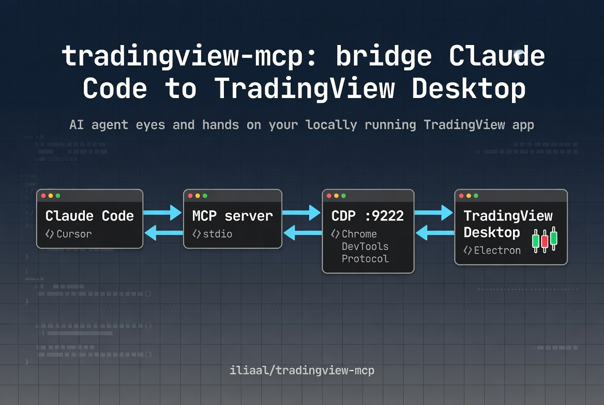

# TradingView MCP Bridge

[](https://github.com/iliaal/tradingview-mcp/actions/workflows/ci.yml)
[](https://github.com/iliaal/tradingview-mcp/releases)
[](LICENSE)
[](https://nodejs.org/)
[](#prerequisites)
[](https://x.com/intent/follow?screen_name=iliaa)



Personal AI assistant for your TradingView Desktop charts. Connects Claude Code to your locally running TradingView app via Chrome DevTools Protocol for AI-assisted chart analysis, Pine Script development, and workflow automation.

> [!WARNING]
> **This tool is not affiliated with, endorsed by, or associated with TradingView Inc.** It interacts with your locally running TradingView Desktop application via Chrome DevTools Protocol. Review the [Disclaimer](#disclaimer) before use.

> [!IMPORTANT]
> **Requires a valid TradingView subscription.** This tool does not bypass or circumvent any TradingView paywall or access control. It reads from and controls the TradingView Desktop app already running on your machine.

> [!NOTE]
> **All data processing occurs locally on your machine.** No TradingView data is transmitted, stored, or redistributed externally by this tool.

> [!CAUTION]
> This tool accesses undocumented internal TradingView APIs via the Electron debug interface. These can change or break without notice in any TradingView update. Pin your TradingView Desktop version if stability matters to you.

## How It Works (and why it's safe to run)

This tool does not connect to TradingView's servers, modify any TradingView files, or intercept any network traffic. It communicates exclusively with your locally running TradingView Desktop instance via Chrome DevTools Protocol (CDP), a standard debugging interface built into all Chromium/Electron applications by Google, including VS Code, Slack, and Discord.

The debug port is disabled by default and must be explicitly enabled by you using a standard Chromium flag (`--remote-debugging-port=9222`). Nothing happens without that deliberate step.

## What This Tool Does Not Do

- Connect to TradingView's servers or APIs
- Store, transmit, or redistribute any market data
- Work without a valid TradingView subscription and installed Desktop app
- Bypass any TradingView paywall or access restriction
- Execute real trades (chart interaction only)
- Work if TradingView changes their internal Electron structure

## Research Context

This project explores an open research question: **how can LLM-based agents interact with professional trading interfaces to support human decision-making?**

Specifically it investigates:

- How structured tool APIs (MCP) can bridge LLMs and stateful desktop financial applications
- What latency, context, and reliability constraints emerge when an agent operates on live chart data
- How agents handle ambiguous financial UI state (e.g. interpreting Pine Script output, reading indicator tables)
- Whether natural language is an effective interface for chart navigation and Pine Script development
- The failure modes of LLM agents operating in real-time data environments

This is not a trading bot. It is an interface layer that makes a trading application legible to an LLM agent, allowing researchers and developers to study human-AI collaboration in financial workflows.

See [RESEARCH.md](RESEARCH.md) for open questions, findings, and related work.

## Prerequisites

- **TradingView Desktop app** (paid subscription required for real-time data)
- **Node.js 18+**
- **Claude Code** with MCP support (for MCP tools) or any terminal (for CLI)
- **macOS, Windows, or Linux**

## ✨ What It Does

Gives your AI assistant eyes and hands on your own chart:

- **Pine Script development**: write, inject, compile, debug, and iterate on scripts with AI assistance
- **Chart navigation**: change symbols, timeframes, zoom to dates, add/remove indicators
- **Visual analysis**: read your chart's indicator values, price levels, and annotations
- **Draw on charts**: trend lines, horizontal lines, rectangles, text annotations
- **Manage alerts**: create, list, and delete price alerts
- **Replay practice**: step through historical bars, practice entries/exits
- **Screenshots**: capture chart state for AI visual analysis
- **Multi-pane layouts**: set up 2x2, 3x1, etc. grids with different symbols per pane
- **Monitor your chart**: stream JSONL from your locally running chart for local monitoring scripts
- **CLI access**: every MCP tool is also a `tv` CLI command, pipe-friendly with JSON output
- **Launch TradingView**: auto-detect and launch with debug mode from any platform

## 🚀 Install with Claude Code

Paste this into Claude Code and it will handle the rest:

> Install the TradingView MCP server. Clone https://github.com/iliaal/tradingview-mcp.git, run npm install, register it with `claude mcp add tradingview --scope user -- node <repo>/src/server.js`, and launch TradingView with the debug port. Then verify the connection with tv_health_check.

Or follow the manual steps below.

## 🛠️ Quick Start

### 1. Install

```bash
git clone https://github.com/iliaal/tradingview-mcp.git
cd tradingview-mcp
npm install
```

### 2. Launch TradingView with CDP

TradingView Desktop must be running with Chrome DevTools Protocol enabled on port 9222.

**Mac:**
```bash
./scripts/launch_tv_debug_mac.sh
```

**Windows:**
```bash
scripts\launch_tv_debug.bat
```

**Linux:**
```bash
./scripts/launch_tv_debug_linux.sh
```

**Or launch manually on any platform:**
```bash
/path/to/TradingView --remote-debugging-port=9222
```

**Or use the MCP tool** (auto-detects your install):
> "Use tv_launch to start TradingView in debug mode"

### 3. Add to Claude Code

Easiest — let the CLI write the config for you:

```bash
claude mcp add tradingview --scope user -- node /path/to/tradingview-mcp/src/server.js
```

Or edit the config by hand. Claude Code reads MCP servers from one of two locations (not `~/.claude/.mcp.json` — that path is ignored):

- **User scope:** `~/.claude.json`, under the top-level `mcpServers` key.
- **Project scope:** `<project-root>/.mcp.json`.

```json
{
  "mcpServers": {
    "tradingview": {
      "command": "node",
      "args": ["/path/to/tradingview-mcp/src/server.js"]
    }
  }
}
```

Replace `/path/to/tradingview-mcp` with your actual path.

### 4. Verify

Ask Claude: *"Use tv_health_check to verify TradingView is connected"*

## 💻 CLI

Every MCP tool is also accessible as a `tv` CLI command. All output is JSON for piping with `jq`.

```bash
# Install globally (optional)
npm link

# Or run directly
node src/cli/index.js <command>
```

### Quick Examples

```bash
tv status                          # check connection
tv quote                           # current price
tv symbol AAPL                     # change symbol
tv ohlcv --summary                 # price summary
tv screenshot -r chart             # capture chart
tv pine compile                    # compile Pine Script
tv pane layout 2x2                 # 4-chart grid
tv pane symbol 1 ES1!              # set pane symbol
tv stream quote | jq '.close'      # monitor price changes
```

### All Commands

```
tv status / launch / ensure / reconnect / state / symbol / timeframe / type / info / search
tv quote / ohlcv / values
tv data lines/labels/tables/boxes/shapes/strategy/trades/equity/depth/indicator
tv pine get/set/compile/raw-compile/analyze/check/save/new/open/list/switch/deploy/publish-inspect/errors/console
tv draw shape/position/list/get/remove/clear
tv alert list/create/create-for-list/delete
tv watchlist get/add/add-bulk/remove/upload/delete/share
tv indicator set/toggle
tv layout list/switch
tv pane list/layout/focus/symbol/timeframe/read-batch
tv tab list/new/close/switch/pin/unpin/registry
tv replay start/step/stop/status/autoplay/trade/set-resolution
tv stream quote/bars/values/lines/labels/tables/all
tv ui click/keyboard/hover/scroll/find/type/panel/fullscreen/mouse
tv hotlist / screener / news / snapshot
tv strategy set-deep-bt-range
tv screenshot / discover / ui-state / range / scroll
```

## Streaming

The `tv stream` commands poll your locally running TradingView Desktop instance at regular intervals via Chrome DevTools Protocol on localhost.

No connection is made to TradingView's servers. All data stays on your machine.

> [!WARNING]
> Programmatic consumption of TradingView data may conflict with their Terms of Use regardless of the data source. You are solely responsible for ensuring your usage complies.

```bash
tv stream quote                          # price tick monitoring
tv stream bars                           # bar-by-bar updates
tv stream values                         # indicator value monitoring
tv stream lines --filter "NY Levels"     # price level monitoring
tv stream tables --filter Profiler       # table data monitoring
tv stream all                            # all panes at once (multi-symbol)
```

## How Claude Knows Which Tool to Use

Claude reads [`CLAUDE.md`](CLAUDE.md) automatically when working in this project. It contains a complete decision tree:

| You say... | Claude uses... |
|------------|---------------|
| "What's on my chart?" | `chart_get_state` → `data_get_study_values` → `quote_get` |
| "What levels are showing?" | `data_get_pine_lines` → `data_get_pine_labels` |
| "Read the session table" | `data_get_pine_tables` with `study_filter` |
| "Give me a full analysis" | `quote_get` → `data_get_study_values` → `data_get_pine_lines` → `data_get_pine_labels` → `data_get_pine_tables` → `data_get_ohlcv` (summary) → `capture_screenshot` |
| "Switch to AAPL daily" | `chart_set_symbol` → `chart_set_timeframe` |
| "Write a Pine Script for..." | `pine_set_source` → `pine_smart_compile` → `pine_get_errors` |
| "Start replay at March 1st" | `replay_start` → `replay_step` → `replay_trade` |
| "Set up a 4-chart grid" | `pane_set_layout` → `pane_set_symbol` for each pane |
| "Draw a level at 24500" | `draw_shape` (horizontal_line) |
| "Take a screenshot" | `capture_screenshot` |

## Tool Reference (108 MCP tools)

### Chart Reading

| Tool | When to use | Output size |
|------|------------|-------------|
| `chart_get_state` | First call: get symbol, timeframe, all indicator names + IDs | ~500B |
| `data_get_study_values` | Read current RSI, MACD, BB, EMA values from all indicators | ~500B |
| `data_get_multi_timeframe` | Iterate a list of timeframes and read indicator values + price summary on each (top-down analysis) | ~1-2KB |
| `data_detect_candlestick_patterns` | Native scan over OHLC for 17 classic patterns (doji, hammer, engulfing, stars, soldiers/crows) | ~1-3KB |
| `quote_get` | Get latest price, OHLC, volume | ~200B |
| `data_get_ohlcv` | Get price bars. **Use `summary: true`** for compact stats | 500B (summary) / 8KB (100 bars) |
| `depth_get` | DOM / order book bid/ask levels (panel must be open) | ~1KB |

### Custom Indicator Data (Pine Drawings)

Read `line.new()`, `label.new()`, `table.new()`, `box.new()`, `plotshape()` output from any visible Pine indicator.

| Tool | When to use | Output size |
|------|------------|-------------|
| `data_get_pine_lines` | Read horizontal price levels (support/resistance, session levels) | ~1-3KB |
| `data_get_pine_labels` | Read text annotations + prices ("PDH 24550", "Bias Long") | ~2-5KB |
| `data_get_pine_tables` | Read data tables (session stats, analytics dashboards) | ~1-4KB |
| `data_get_pine_boxes` | Read price zones / ranges as {high, low} pairs | ~1-2KB |
| `data_get_pine_shapes` | Read `plotshape()` / `plotchar()` markers with bar OHLC + timestamp | ~2-4KB |
| `pane_read_batch` | Single call: read pine_lines/labels/tables/boxes/study_values/ohlcv/drawings across all panes | ~4-10KB |

**Always use `study_filter`** to target a specific indicator: `study_filter: "Profiler"`.

### Strategy Data

Read backtest results from a Pine Script strategy on the chart. The Strategy Tester panel must be open (use `ui_open_panel`).

| Tool | What it reads |
|------|---------------|
| `data_get_strategy_results` | Strategy performance metrics (net profit, win rate, drawdown, etc.) |
| `data_get_strategy_info` | Active strategy name + Strategy Tester date range — sanity-check before reading metrics |
| `data_get_trades` | Individual trade list with entry/exit, P&L per trade |
| `data_get_equity` | Equity curve data points |
| `strategy_set_deep_bt_range` | Set the Deep Backtesting date range via the Strategy Tester calendar picker |

### News & Signals

| Tool | What it does |
|------|-------------|
| `news_get_ticker` | Latest ticker-specific headlines (Nasdaq + Yahoo Finance RSS) with keyword sentiment scoring. Index symbols (SPX, NDX, DJI, RUT, VIX) auto-route to their tracking ETF |
| `signal_get_snapshot` | Compact one-shot bundle: quote + 100-bar price action (SMA20/50, ATR14, %change) + volume-vs-avg + visible indicator values + latest news with sentiment. Sections degrade gracefully |

### Screener

| Tool | What it does |
|------|-------------|
| `screener_scan` | Scan TradingView screeners (stocks, ETFs, crypto, forex, futures, indices) via the public scanner endpoint. Market presets, keyword search, explicit ticker hydration, exchange + numeric range filters |
| `hotlist_get` | Fetch a TradingView US hotlist (volume_gainers, gap_gainers, percent_change_gainers/losers, etc.) — up to 20 symbols, no auth |

### Chart Control

| Tool | What it does |
|------|-------------|
| `chart_set_symbol` | Change ticker (BTCUSD, AAPL, ES1!, NYMEX:CL1!) |
| `chart_set_timeframe` | Change resolution (1, 5, 15, 60, D, W, M) |
| `chart_set_type` | Change style (Candles, HeikinAshi, Line, Area, Renko) |
| `chart_manage_indicator` | Add/remove indicators. **Use full names**: "Relative Strength Index" not "RSI" |
| `chart_remove_studies_by_title` | Remove all studies whose name contains a case-insensitive substring (bulk cleanup of duplicates) |
| `chart_scroll_to_date` | Jump to a date (ISO: "2025-01-15") |
| `chart_set_visible_range` | Zoom to exact range (unix timestamps) |
| `chart_get_visible_range` | Read the current visible date range and bars range |
| `symbol_info` / `symbol_search` | Symbol metadata and search |
| `indicator_set_inputs` / `indicator_toggle_visibility` | Change indicator settings, show/hide |
| `data_get_indicator` | Read inputs + visibility for a specific indicator by entity_id |

### Multi-Pane Layouts

| Tool | What it does |
|------|-------------|
| `pane_list` | List all panes with symbols and active state |
| `pane_set_layout` | Change grid: `s`, `2h`, `2v`, `2x2`, `4`, `6`, `8` |
| `pane_focus` | Focus a specific pane by index |
| `pane_set_symbol` | Set symbol on any pane |
| `pane_set_timeframe` | Set timeframe on a specific pane without focusing it |
| `pane_read_batch` | Read multiple data types across all panes in one call (see Custom Indicator Data) |

### Tab Management

| Tool | What it does |
|------|-------------|
| `tab_list` | List open chart tabs (includes active Pine script name per tab) |
| `tab_new` / `tab_close` | Open/close tabs |
| `tab_switch` | Switch to a tab by index |
| `tab_switch_by_name` | Switch by Pine script name (exact match → substring fallback) |
| `tab_pin` | Pin the MCP to one specific tab so every call deterministically targets it (cross-instance registry at `~/.tv-mcp-registry.json`) |
| `tab_unpin` | Clear the tab pin and release the registry claim |
| `tab_registry` | Read-only view of the cross-instance pin registry — check before `tab_pin` |

### Pine Script Development

| Tool | Step |
|------|------|
| `pine_set_source` | 1. Inject code into editor |
| `pine_compile` | 2a. Manually click "Add to chart" / "Update on chart" |
| `pine_smart_compile` | 2b. Compile with auto-detection + error check (returns `elapsed_ms`) |
| `pine_get_errors` | 3. Read compilation errors if any |
| `pine_get_console` | 4. Read log.info() output |
| `pine_save` | 5. Save to TradingView cloud |
| `pine_save_as` | Save current source as a new script under a different name |
| `pine_rename` | Rename the currently open script |
| `pine_delete` | Delete a saved script by name |
| `pine_switch_script` | Switch the editor to a different saved script |
| `pine_version_history` | Open TV's "Version history" dialog for the current script |
| `pine_get_source` | Read current script (**warning: can be 200KB+ for complex scripts**) |
| `pine_new` | Create blank indicator/strategy/library |
| `pine_open` / `pine_list_scripts` | Open or list saved scripts |
| `pine_analyze` | Offline static analysis (no chart needed) |
| `pine_check` | Server-side compile check (no chart needed) |
| `pine_deploy` | One-shot deploy from a `.pine` file on disk: `pine_set_source` + `pine_save` + `pine_smart_compile`, with auto-derived pre-clean of any prior chart instance. Source is never embedded in the call — no token tax on big scripts |
| `pine_publish_dialog_inspect` | **Read-only** probe of the "Publish script" dialog — dumps every input/button/heading with class names + label text for selector discovery. Does not submit |

### Replay Mode

| Tool | Step |
|------|------|
| `replay_start` | Enter replay at a date |
| `replay_step` | Advance one bar |
| `replay_autoplay` | Auto-advance (set speed in ms) |
| `replay_trade` | Buy/sell/close positions |
| `replay_status` | Check position, P&L, date |
| `replay_set_resolution` | Change replay resolution while paused |
| `replay_stop` | Return to realtime |

### Drawing

| Tool | What it does |
|------|-------------|
| `draw_shape` | Draw horizontal_line, trend_line, rectangle, text |
| `draw_position` | Draw an entry + stop-loss + take-profit risk box |
| `draw_list` | List all drawings on the chart |
| `draw_get_properties` | Read points, visibility, lock state for a specific drawing |
| `draw_remove_one` | Remove a drawing by entity_id |
| `draw_clear` | Remove all drawings |

### Alerts

| Tool | What it does |
|------|-------------|
| `alert_create` | Create a price alert via TV's create-alert dialog |
| `alert_create_for_watchlist` | Create an alert that applies to every symbol on a watchlist |
| `alert_create_indicator` | Create an indicator alert that fires on a Pine `alertcondition()` signal (e.g. strategy BUY/SELL → webhook). Posts to the `pricealerts` REST API |
| `alert_list` | List active alerts (uses the pricealerts REST API) |
| `alert_delete` | Delete one or all alerts |

### Watchlist

| Tool | What it does |
|------|-------------|
| `watchlist_get` | Read current watchlist with last/change/change% |
| `watchlist_add` | Add a single symbol |
| `watchlist_add_bulk` | Add multiple symbols in one dialog session |
| `watchlist_remove` | Remove one or more symbols |
| `watchlist_upload` | Upload/import a local TradingView watchlist text file |
| `watchlist_delete` | Delete a watchlist by name |
| `watchlist_get_share_link` | Get a shareable watchlist link, enabling sharing if needed |

### UI Automation

| Tool | What it does |
|------|-------------|
| `ui_open_panel` | Open/close/toggle panels (pine-editor, strategy-tester, watchlist, alerts, trading) |
| `ui_click` | Click a UI element by aria-label, data-name, text, or class substring |
| `ui_keyboard` | Press keyboard keys or shortcuts (Enter, Escape, Alt+S, Ctrl+Z) |
| `ui_type_text` | Type text into the focused input |
| `ui_hover` | Hover over an element |
| `ui_scroll` | Scroll the chart up/down/left/right |
| `ui_mouse_click` | Click at specific x,y coordinates |
| `ui_find_element` | Find UI elements and return positions |
| `ui_fullscreen` | Toggle fullscreen |
| `ui_dismiss_dialogs` | Detect and dismiss blocking modals (Leave-replay, unsaved-changes, Save-script) |
| `layout_list` / `layout_switch` | Manage saved layouts |
| `capture_screenshot` | Screenshot (regions: full, chart, strategy_tester) |

### Connection Management

| Tool | What it does |
|------|-------------|
| `tv_launch` | Launch TradingView Desktop with CDP enabled (auto-detects binary on Mac/Windows/Linux/WSL/MSIX) |
| `tv_ensure` | Idempotent: no-op if CDP is up; relaunches if needed. Call before any tool when unsure |
| `tv_health_check` | Verify CDP connection and report current chart state |
| `tv_network_check` | Check reachability for TradingView data/search/Pine endpoints |
| `tv_ui_state` | Snapshot of which panels/buttons are open and visible |
| `tv_discover` | Report which TV API paths are available |
| `tv_reconnect` | Reload the TV page to reclaim a stale Desktop session |

### Batch Operations

| Tool | What it does |
|------|-------------|
| `batch_run` | Run an action (`screenshot` / `get_ohlcv` / `get_strategy_results`) across multiple symbols × timeframes |

## Context Management

Tools return compact output by default to minimize context usage. For a typical "analyze my chart" workflow, total context is ~5-10KB instead of ~80KB.

| Feature | How it saves context |
|---------|---------------------|
| Pine lines | Returns deduplicated price levels only, not every line object |
| Pine labels | Capped at 50 per study, text+price only |
| Pine tables | Pre-formatted row strings, no cell metadata |
| Pine boxes | Deduplicated {high, low} zones only |
| OHLCV summary mode | Stats + last 5 bars instead of all bars |
| Indicator inputs | Encrypted/encoded blobs auto-filtered |
| `verbose: true` | Pass on any pine tool to get raw data with IDs/colors when needed |
| `study_filter` | Target one indicator instead of scanning all |

## Finding TradingView on Your System

Launch scripts and `tv_launch` auto-detect TradingView. If auto-detection fails:

| Platform | Common Locations |
|----------|-----------------|
| **Mac** | `/Applications/TradingView.app/Contents/MacOS/TradingView` |
| **Windows** | `%LOCALAPPDATA%\TradingView\TradingView.exe`, `%PROGRAMFILES%\WindowsApps\TradingView*\TradingView.exe` |
| **Linux** | `/opt/TradingView/tradingview`, `~/.local/share/TradingView/TradingView`, `/snap/tradingview/current/tradingview` |

The key flag: `--remote-debugging-port=9222`

## Testing

```bash
# Requires TradingView running with --remote-debugging-port=9222
npm test
```

29 tests covering: Pine Script static analysis, server-side compilation, and CLI routing.

## Architecture

```
Claude Code  ←→  MCP Server (stdio)  ←→  CDP (port 9222)  ←→  TradingView Desktop (Electron)
```

- **Transport**: MCP over stdio (108 tools) + CLI (`tv` command, pipe-friendly JSON output)
- **Connection**: Chrome DevTools Protocol on localhost:9222
- **Streaming**: Poll-and-diff loop with deduplication, JSONL output to stdout
- **No dependencies** beyond `@modelcontextprotocol/sdk` and `chrome-remote-interface`

## Attributions

This project is not affiliated with, endorsed by, or associated with:
- **TradingView Inc.**: TradingView is a trademark of TradingView Inc.
- **Anthropic**: Claude and Claude Code are trademarks of Anthropic, PBC.

This tool is an independent MCP server that connects to Claude Code via the standard MCP protocol. It does not contain or modify any Anthropic software.

## Disclaimer

This project is provided **for personal, educational, and research purposes only**.

**How this tool works:** This tool uses the Chrome DevTools Protocol (CDP), a standard debugging interface built into all Chromium-based applications by Google. It does not reverse engineer any proprietary TradingView protocol, connect to TradingView's servers, or bypass any access controls. The debug port must be explicitly enabled by the user via a standard Chromium command-line flag (`--remote-debugging-port=9222`).

By using this software, you acknowledge and agree that:

1. **You are solely responsible** for ensuring your use of this tool complies with [TradingView's Terms of Use](https://www.tradingview.com/policies/) and all applicable laws.
2. TradingView's Terms of Use **restrict automated data collection, scraping, and non-display usage** of their platform and data. This tool uses Chrome DevTools Protocol to programmatically interact with the TradingView Desktop app, which may conflict with those terms.
3. **You assume all risk** associated with using this tool. The authors are not responsible for any account bans, suspensions, legal actions, or other consequences resulting from its use.
4. This tool **must not be used** for, including but not limited to:
   - Redistributing, reselling, or commercially exploiting TradingView's market data
   - Circumventing TradingView's access controls or subscription restrictions
   - Performing automated trading or algorithmic decision-making using extracted data
   - Violating the intellectual property rights of Pine Script indicator authors
   - Connecting to TradingView's servers or infrastructure (all access is via the locally running Desktop app)
5. The streaming functionality monitors your locally running TradingView Desktop instance only. It does not connect to TradingView's servers or extract data from TradingView's infrastructure.
6. Market data accessed through this tool remains subject to exchange and data provider licensing terms. **Do not redistribute, store, or commercially exploit any data obtained through this tool.**
7. This tool accesses internal, undocumented TradingView application interfaces that may change or break at any time without notice.

**Use at your own risk.** If you are unsure whether your intended use complies with TradingView's terms, do not use this tool.

## License

MIT. See [LICENSE](LICENSE) for details.

The MIT license applies to the source code of this project only. It does not grant any rights to TradingView's software, data, trademarks, or intellectual property.

---

[Follow @iliaa on X](https://x.com/iliaa) • [Blog](https://ilia.ws) • If this gave your AI agent eyes on your chart, ⭐ star it!
